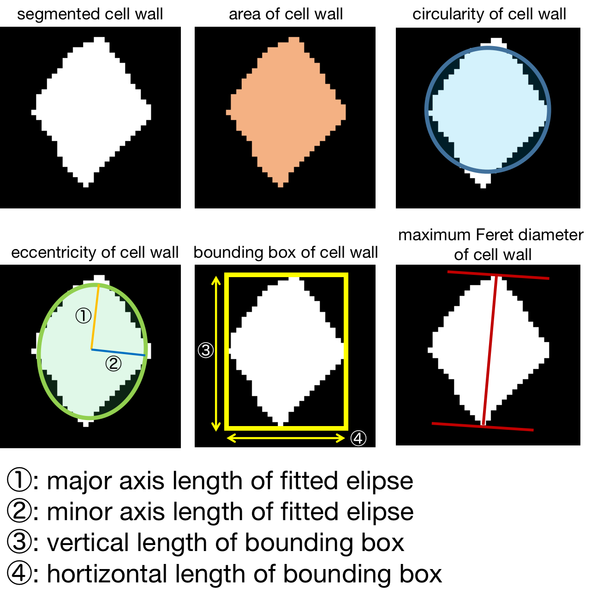
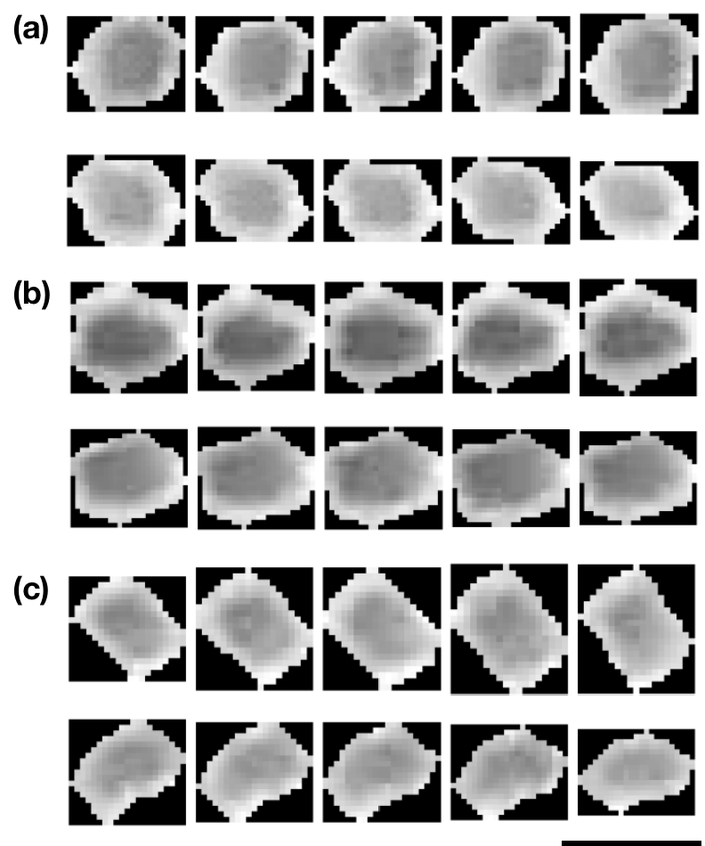

# Title:

# Deformation of wood cell wall during three-point bending test studied by computer vision and machine learning

---

Authors: Shuoye Chen, XXXX, Junji Sugiyama

Affiliations: Graduate School of Agriculture, Kyoto University, 

E-mail: chenshuoye@gmail.com

---

## Abstract

## Keywords:

Cell wall deformation, Mechanical property, Semantic segmentation, U-net, Computer vision, Deep learning, Particle tracking

---

## 1. introduction

Wood is a natural cellular material, it has complex structure with different cell types (anatomical features) acting together to serve the needs of living tree [1]. Also, as an anisotropic material,  wood has excellent mechanical properties parallel to the grain ( longitudinal direction), while its mechanical properties perpendicular to the grain (transverse direction) are relatively weak [2] and varied among different wood species with relation to their unique anatomical features [1]. 

Also, as a construction materials, human tried to use it for making building considering its anatomical structure. For example, a traditional roofing method called kokerabuki in japan......

To completely unveil the relationship between anatomical features and mechanical behavior of wood, the quantitative and accurate analysis of local deformation of anatomical features during the mechanical test is an important subject. Up to now, wood scientists developed several approaches from two perspectives for understanding how anatomical features affect the mechanical behavior of wood in transverse direction. 

The first one is **top-down perspective** that is direct microscopic observation of deformation of anatomical features during or after the mechanical test. Ando and Onda (1999) [3] used wet-type scanning electron microscope (SEM) to observe the compression of wood cell wall. Combing with image analysis, it was found that the first fracture of cell wall occurred in one tangential row of earlywood tracheids just after the load displacement curve exceeded the proportional limit. Müller et al. (2003) [4] observed cell deformation of both softwood (spruce) and hardwood (oak and beech) at different yielding stage of compression test by using both SEM and light microscope for concluding different fracture pattern of anatomical features in those species. Hwang et al. (2021) [5] used the replica method to intermittently analyze the cell wall deformation of flat-swan, quarter-swan and rift-swan in transverse direction of wood due to three point bending test. The rift-swan of softwood exhibited a unique shear deformation of earlywood cell wall contributing for the extremely large flexural deformation. Such direct microscopic observation methods provides important information to understand the in-situ deformation of wood microstructures.

The second one is **bottom-up perspective** that is the mechanical simulation of wood properties considering its hierarchical structure.  Watanabe et al. [6-8] firstly used fast Fourier transform (FFT) to extract the characteristics such as axial length of tangential and radial cell wall, cell wall thickness, etc. of several conifer wood species for simulating the tangential Young's modulus by cell wall model. Ando and Onda [9] used generalized cell wall model to successfully simulated the first buckling mechanism of conifer wood cell wall under radial compression. Holmberg et al. [10] used finite element method (FEM) to simulate the nonlinear mechanical behavior considering the irregular cell shape, anisotrpic layer structure of the cell walls and the periodic variations in density of wood. And their simulated deformation and fracture of wood was similar to the those found in the refining process of wood. De Magistris and Salmén (2008) [11] investigate the compression and in combined shear and compression deformation of cell wall with anisotropic one-layer cell walls and orthotropic multi-layer cell wall models by finite element method (FEM) . Their results indicates the cell structures is the key factors influencing the deformation pattern.  Recently the multi-scale FEM is adopted to simulate wood compression behavior under both axis and transverse loading [12]. it was found that transverse deformation of wood is gradual and uniform,  while the loading velocity greatly affects wood microstructure failure modes in axial loading. Those developed approaches are quite useful and powerful for providing comprehensive explanation of mechanical behavior of  wood.

On the other hand, in the field of computer vision, the semantic segmentation has been proposed as a important approach to label each pixel of an image with a corresponding class of what is represented. With the development of artificial intelligence, the deep-learning based semantic segmentation model such as U-Net[13], LinkNet [14], Feature Pyramid Networks [15], and Pyramid Scene Parsing Network [16] has been developed and those technology that has large field of application and already started to be applied into the field autonomous vehicles [17] and  analysis of biomedical image for medical diagnosis [18]. If the approach of semantic segmentation can also be adapted for analyzing the cell wall deformation, it provides a great possibility to simultaneously analyze almost all local changes in anatomical features and their interaction during the mechanical test. Furthermore, the observed information provides more accurate and quantitative image analysis and the collected cell wall geometry can also be used for more realistic mechanical simulation for optimizing developed both top-down and bottom-up approaches. 

Therefore, in this study, the semantic segmentation model has been built for the partitioning of anatomical features of hinoki wood, and their local deformation during the micro three-point bending test were precisely analyzed with the help of individual cell tracking algorithm .

## 2. materials and method

#### 2.1 specimen preparation

Hinoki (*Chamaecyparis obtusa*) was used in this study. Three types of (flat-swan, rift-swan and quarter-swan) samples were firstly prepared considering their orientation of annual ring by visual confirmation. The annual ring aligned at horizontal direction and vertical direction were 0° and 90°, respectively. The sample with the angle of annual ring of 0° to 30° was defined as flat-swan, 30° to 60° was defined as rift-swan and 60° to 90° were defined as quarter-swan. After that, the 5 specimens of flat-swan, quarter-swan and rift-swan, respectively, were prepared with the dimension of 10 mm (longitudinal) x 20 mm (width) x 1.5 mm (thickness). Then, the cross section of all specimens were smoothed by a sliding microtome (TU-213, Yamato kohki industrial Co., Ltd., Japan). All specimens were then  conditioned at a plastic glove box at 60% relative humidity (RH) and 25°C by using sodium bromide solution for more than two weeks.

#### 2.2 micro three-point bending test

After the conditioning, all specimens were subjected to the micro three-point bending test. The customized metal jig (Fig. X (a)) was used for the test. A motor (BLM230P-GFV2, ORIENTAL MOTOR Co.,Ltd., Japan) with test speed of 1mm/min was used to horizontally bend the specimen. And a 200N load cell (LUR-A-200NSA1, Kyowa Electronic Instruments Co., Ltd., Japan) with sensor interface (PCD-320A, Kyowa Electronic Instruments Co., Ltd., Japan) was used to record the force, the sampling speed is 1Hz. During the test, a stereo-microscope (Leica DMS300, Leica Camera AG, Germany) was used to record the deformation of cell wall by video mode with 30 fps. The resolution was 1080p and the length of one pixel is equal to about 2.09 *µ*m. All experiment was conducted at 60% RH and 25°C.

Fig. 1 The illustration of micro three-point bending test. (a) The illustrated apparatus used for the test. (b) Cross section of wood specimen observed by stereo-microscope.

#### 2.3 Deep learning based semantic segmentation model

With the development of artifical intelligence 

As a fully connected network with skip-connection　

And U-Net has been concluded as an promising segmentation model for wood anatomical structure. Therefore, in this study, the U-Net has been selected for building model.

After the video taking during the bending test, the first image at every second of the video was captured for preparing the image sequence. The 12 original images with 256 pixels x 256 pixels were cropped from the image sequence recorded by. The watershed segmentation was firstly applied for label the boundary of wood cell wall. The unlabeled part was manually modified to make their corresponding ground truth masks with cell wall boundary labeled in white and background labeled in black were manually prepared. Finally, The 12 sets of original image and corresponding ground truth mask were used for building semantic segmentation model. And the asymmetric U-net architecture with batch normalization was used for the model training. (Fig.X )

Fig. 2 Preparation of data set for semantic segmentation model training. (a) Cropped patch of cross section of wood; (b) cell wall boundary labeled mask by watershed segmentation algorithm (c) manually corrected image mask. The scale bar indicates length of 100 micrometer

#### 2.4 image prediction and individual cell tracking

After model training, the trained model combined with the patch blending algorithm implemented by Vooban [19] were used to conduct partition of all potential cells in the image sequence with 1920 pixels x 1080 pixels. After predicting all image sequence, watershed segmentation was applied again to achieve the instance segmentation of all cells. Finally, the coordinates of centriod of all cells were collected and a tracking algorithm (Crocker-Grier linking algorithm) implemented by trackpy [20, 21] was used to link the same cell walls exist in each image.

Fig.3 tracking the cell wall deformation during mechanical test. (a) watershed segmentation of predicted image by trained U-net model to achieve instance segmentation; (b) The coordinates of centriods of each cell wall were exacted as the features for particle linking; (c)  trajectories was found by Crocker-Grier linking algorithm.

#### 2.5 parameters measurement for cell wall deformation analysis

Finally, after the tracking of individual cell, the area, eccentricity, major/minor axis length, vertical/horizontal length of bounding box and maximum Feret diameter of each cell wall for analyzing their intensity of cell wall deformation (Fig. X). And their rate of change during the bending test was also calculated based on the following equation:

the n indicates the order of the observed image sequence. The i indicates the measured parameters showed on Fig.X.

Fig.4 the measurement parameters to evaluate the intensity of deformation of cell wall

## 3. results and discussion

#### 3.1 mechanical properties of flat-swan, quarter-swan and rift-swan

The Fig discuss the force-displacement curve, modulus of elasticity and modulus of rupture. In comparison to the 

the orientation of annual ring play an important role on 

Fig.5 mechanical properties of flat-swan, quarter-swan and rift-swan of hinoki specimens. (a) load and displacement of three types of hinoki specimens during micro three-point test. (b) MOE (modulus of elasticity) and MOR (modulus of rupture) of three types of hinoki specimen; the error bars indicate the standard deviation.

#### 3.2 Validation of U-net model and cell wall deformation tracking

discuss the training results (loss vs. epoch, accuracy/f1_score vs. epoch) 

show the predicted mask (problem: the latewood part was not well predicted)

the metrics was used for the model evaluation, the accurate model has been built

the extracted typical cell wall 

Fig. 6 cell wall boundary prediction by trained U-net model. (a) binary cross entropy loss plotted against the training epochs; (b) input original image; (c) predicted image

Table. 1 the evaluated metrics for predicted images by trained U-net model

| accuracy     | f1_score     | recall       | precision    |
|:------------:|:------------:|:------------:|:------------:|
| 0.92 (0.006) | 0.82 (0.017) | 0.82 (0.019) | 0.82 (0.017) |

Fig.7 typical deformation of wood cell wall for three types of hinoki specimens during micro three-point bending test. (a) cell wall deformation of flat-swan specimen, upper: compression part, lower: tension part; (b) cell wall deformation of quarter-swan specimen, upper: compression part, lower: tension part; (c) cell wall deformation of rift-swan specimen, upper: compression part, lower: tension part. The scale bar indicates 50 $μ$m

#### 3.3 Visualization of the intensity of cell wall deformation

show the map with several parameters as example, discuss the cell wall deformation from elastic region to plastic region

Fig. 8

#### 3.4 Clustering Relationship between changes in intensity of cell wall deformation and Stress-strain curve

The variety of the cell wall deformation pattern and its relationship with  strain-stress curve

Fig.9

## 4. Conclusion

## 5. Reference

> 1. Forest Products Laboratory (1999) Wood Handbook-Wood as an Engineering Material; General Technical Report FPL-GTR-113; U.S. Department of Agriculture, Forest Service, Forest Products Laboratory: Madison, WI, USA.

> 2. Gibson LJ, Ashby MF (1998) Cellular Solids: Structure and Properties; Pergamon Press: New York, NY, USA.

> 3. Ando K and  Onda H (1999) Mechanism for deformation of wood as a honeycomb structure I: effect of anatomy on the initial deformation process during radial compression. J Wood Sci 45: 120-125.

> 4. Müller U, Gindl W, Teischinger A (2003) Effects of cell anatomy on the plastic and elastic behaviour of different wood species loaded perpendicular to grain. IAWA J 24: 117–128.

> 5. Hwang S, Isoda H, Nakagaw T, Sugiyama J (2021) Flexural anisotropy of rift-sawn softwood boards induced by the end-grain orientation. J Wood Sci 67: 14.

> 6. Watanabe  U,  Norimoto M,  Ohgama T,  Fujita  M (1999)  Tangential Young’s modulus of coniferous early wood investigated using cell models. Holzforschung 53: 209–214.

> 7. Watanabe U,  Norimoto  M,  Morooka T (2000) Cell wall thickness and tangential Young’s modulus in coniferous early wood.  J Wood Sci: 46, 109–114.

> 8. Watanabe U,  Fujita M,  Norimoto M (2002) Transverse Young’s moduli and cell shapes in coniferous early wood. Holzforschung 56: 1–6.

> 9. Ando K and Onda H (1999) Mechanism for deformation of wood as a honeycomb structure II: First buckling mechanism of cell walls under radial compression using the generalized cell model. J Wood Sci 45:250-253.

> Gibson LJ (2012)  The hierarchical structure and mechanics of plant materials. J R Soc Interface 9: 2749-2766.

> 10. Holmberg S, Persson K, Petersson H (1999) Nonlinear mechanical behaviour and analysis of wood and fibre materials. Comput Struct 72: 459-480.

> 11. De Magistris, F, Salmén L (2008) Finite Element modelling of wood cell deformation transverse to the fibre axis. Nord Pulp Pap Res J23: 240–246.

> 12. Zhong W, Zhang Z, Chen X, Wei Q, Chen G, Huang X (2021) Multi-scale finite element simulation on large deformation behavior of wood under axial and transverse compression conditions. Acta Mech Sin 37: 1136-1151.

> 13. Ronneberger O, Fischer P, Brox T (2015) U-Net: convolutional networks for
>     biomedical image segmentation, Lect. Notes Comput. Sci. (including Subser Lect Notes Artif Intell Lect Notes Bioinformatics) 9351:234–241.

> 14. Chaurasia A,  Culurciello E (2017) LinkNet: Exploiting encoder representations for efficient semantic segmentation. In Proceedings of the 2017 IEEE Visual Communications and Image Processing (VCIP), St. Petersburg, FL, USA, 1–4.

> 15. Lin T, Dollár P, Girshick R, He K, Hariharan B, Belongie S (2017) Feature pyramid networks for object detection. In: IEEE conference on computer vision and pattern recognition : 936–944.

> 16. Zhao H, Shi J, Qi X, Wang X, Jia J (2017) Pyramid scene pars-ing network. In: 2017 IEEE Conference on Computer Vision and Pattern Recognition (CVPR), IEEE, 2017, pp. 2881–2890 .

> 17. Janai J, Güney F, Behl A,Geiger A (2020) Computer Vision for Autonomous Vehicles: Problems, Datasets and State of the Art. Found. Trends Comput Graph Vis 12, 85.

> 18. Müller D, Kramer F. (2021) MIScnn: a framework for medical image segmentation with convolutional neural networks and deep learning. BMC Med Imaging 21: 12.

> 19. https://github.com/Vooban/Smoothly-Blend-Image-Patches

> 20. Crocker, J C, Grier, D G (1996) Methods of digital video microscopy for colloidal studies. J Colloid Interf Sci, 179: 298–310.

> 21. Allan, D. B., Caswell, T., Keim, N. C. & van der Wel, C. M. trackpy: Trackpy v0.5.0. (Zenodo, 2018). doi:10.5281/zenodo.1226458

> 22. Garcia-Pedrero, A, García-Cervigón I A, Olano J M , García-Hidalgo M, Lillo-Saavedra M, Gonzalo-Martín C, Caetano C, Calderón-Ramírez S (2020) Convolutional neural networks for segmenting xylem vessels in stained cross-sectional images. Neural Comput Appl 32: 17927-17939

> 23. Wolny A, Cerrone L, Vijayan A, Tofanelli R, Barro AV, Louveaux M, Wenzl C, Strauss S, Wilson-Sánchez D, Lymbouridou R, Steigleder S S, Pape C, Bailoni A, Duran-Nebreda S, Bassel GW, Lohman JU, Tsiantis M, Hamprecht FA, Scheitz K, Maizel A, Kreshuk A (2020) Accurate and versatile 3D segmentation of  plants tissues at cellular resolution, elife 29.

> Wolny A, Cerrone L, Vijayan A, Tofanelli R, Barro AV, Louveaux M, Wenzl C, Strauss S, Wilson-Sánchez D, Lymbouridou R, Steigleder SS, Pape C, Bailoni A, Duran-Nebreda S, Bassel GW, Lohmann JU, Tsiantis M, Hamprecht FA, Schneitz K, Maizel A, Kreshuk A. Accurate and versatile 3D segmentation of plant tissues at cellular resolution. Elife. 2020 Jul 29;9:e57613. doi: 10.7554/eLife.57613. PMID: 32723478; PMCID: PMC7447435.

## 6. Acknowledgement
