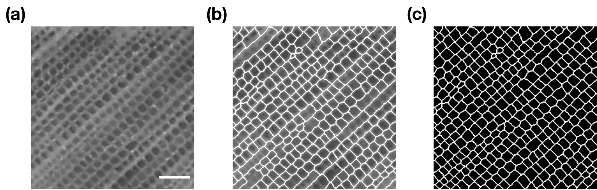
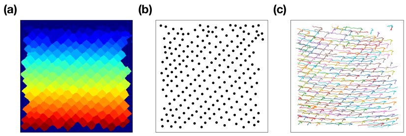
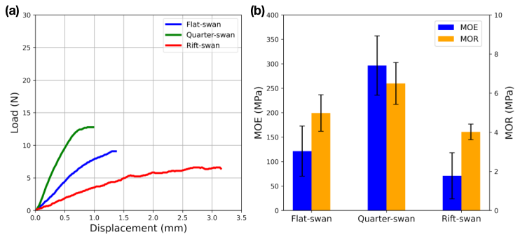
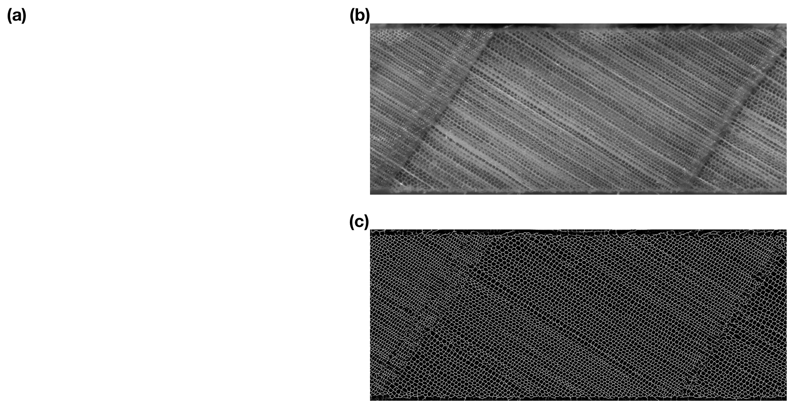

# Title:

# Deformation of wood cell wall during three-point bending test analyzed by computer vision and machine learning

---

Authors: Shuoye Chen, XXXX, Junji Sugiyama

Affiliations: Graduate School of Agriculture, Kyoto University, 

E-mail: chenshuoye@gmail.com

---

## Abstract

## Keywords:

Cell wall deformation, Mechanical property, Semantic segmentation, U-net, Computer vision, Deep learning, Particle tracking

---

## 1. introduction

    As a natural cellular material, wood has complex structure with different cell types (anatomical features) acting together to serve the needs of living tree. 

    Those features have large variation with different wood species that highly influence the mechanical properties of wood. 

    The anatomical features influence a lot on the mechanical properties of transverse direction of wood. Up to now, several researches have been conducted to understand their relationship: 

    Main approach#1: direct observation of deformed wood cell wall by microscope during or after the mechanical test. Limitation: Only the focused part were analyzed, ( Ando sensei;, ....), the analysis was not always quantitative. 

    Main approach#2:  simulation of deformation of cell wall by finite element method (FEM). Limitation: only the homogenized geometry of wood cell wall  were used. (Watanabe et al., Gibson et al. ...)

    To completely unveil the relationship between anatomical features and mechanical behavior of wood, the quantitative and accurate analysis of local deformation of anatomical features during the mechanical test is an important subject. However, due to its technical difficulty, only a few studies around this topic have been conducted. 

    On the other hand, with the development of computer vision in the field of artificial intelligence, the semantic segmentation has been proposed as a promising approach to label each pixel of an image with a corresponding class of what is represented. (U-net and)

    If such approach can be applied into the field of wood science, it provides a great possibility to simultaneously analyze almost all local changes in anatomical features and their interaction during the mechanical test.

    Therefore, in this study, the semantic segmentation model has been built for conducting partition of anatomical features, and their local deformation during the micro three-point bending test were precisely analyzed.

## 2. materials and method

#### 2.1 specimen preparation

   Hinoki (*Chamaecyparis obtusa*) was used in this study. Three types of (flat-swan, rift-swan and quarter-swan) samples were firstly prepared considering their orientation of annual ring by visual confirmation. The annual ring aligned at horizontal direction and vertical direction were 0° and 90°, respectively. The sample with the angle of annual ring of 0° to 30° was defined as flat-swan, 30° to 60° was defined as rift-swan and 60° to 90° were defined as quarter-swan. After that, the 5 specimens of flat-swan, quarter-swan and rift-swan, respectively, were prepared with the dimension of 10 mm (longitudinal) x 20 mm (width) x 1.5 mm (thickness). Then, the cross section of all specimens were smoothed by a sliding microtome (Yamato, co Ltd...). All specimens were conditioned at a plastic glove box at 60% relative humidity (RH) and 25°C by using sodium bromide solution for more than two weeks.

#### 2.2 micro three-point bending test

    After the conditioning, all specimens were subjected to the micro three-point bending test. The Fig. A customized metal jig was used for the test. A motor () with test speed of 1mm/min was used to horizontally bend the specimen. And a 100N load cell () was used to record the force, the sampling speed is 1Hz. During the test, a stereo-microscope (Leica DMS300, Leica Camera AG, Germany) was used to record deformation of wood cell wall by video mode with 30 fps. The resolution was 1080p and the length of one pixel is equal to about 2.09 *µ*m. All experiment was conducted at 60-65% RH and 25 to 27°C.

Fig. X The illustration of micro three-point bending test. (a) The illustrated apparatus used for the test. (b) Cross section of wood specimen observed by stereo-microscope.

#### 2.3 building deep learning based semantic segmentation model

    After the video taking during the bending test, the first image at every second of tje image was captured for preparing the image sequence. The 12 original images with 256 pixels x 256 pixels were cropped from the image sequence recorded by. The watershed segmentation was firstly applied for label the boundary of wood cell wall. The unlabeled part was manually modified to make their corresponding ground truth masks with cell wall boundary labeled in white and background labeled in black were manually prepared. Finally, The 12 sets of original image and corresponding ground truth mask were used for building semantic segmentation model. And the asymmetric U-net architecture was used for the model training. (Figure for )

Fig. X Preparation of data set for semantic segmentation model training. (a) Cropped patch of cross section of wood; (b) cell wall boundary labeled mask by watershed segmentation algorithm (c) manually corrected image mask. The scale bar indicates length of 100 micrometer

#### 2.4 image prediction and tracking of cell wall deformation

    After model training, the model with the patch blending algorithm implemented by Vooban were used to partition all cell walls in the image sequence with 1920 pixels x 1080 pixels. After predicting image sequence, watershed segmentation was applied again to achieve the instance segmentation of cell walls. Finally, a tracking algorithm (Crocker-Grier linking algorithm) implemented by trackpy () was used to link the same cell walls exist in each image.

Fig.X tracking the cell wall deformation during mechanical test. (a) watershed segmentation of predicted image by trained U-net model to achieve instance segmentation; (b) The coordinates of centriods of each cell wall were exacted as the features for particle linking; (c)  trajectories was found by Crocker-Grier linking algorithm.

#### 2.5 parameters measurement for cell wall deformation analysis

    After the tracking of cell wall, scikit-image was used to measured the area, eccentricity, major/minor axis length, vertical/horizontal length of bounding box and maximum Feret diameter of each cell wall for analyzing their intensity of cell wall deformation. And their rate of change during the bending test was also calculated based on the following equation:

- area: the area of the measured region

- eccentricity: the eccentricity of the ellipse that has the same second-moments as the region. When it is 0, the ellipse becomes a circle.

- circularity: (4 * pi * area) / (perimeter**2)

- major axis length: the length of the major axis of the ellipse that has the same normalized second central moments as the region.

- minor axis length: the length of the minor axis of the ellipse that has the same normalized second central moments as the region.

- aspect ratio #1: major axis length/minor axis length

- horizontal length of bounding box

- vertical length of bounding box

- aspect ratio #2: horizontal length of bounding box/ vertical length of bounding box

- Maximum Feret diameter

- 

## 3. results and discussion

#### 3.1 mechanical properties of flat-swan, quarter-swan and rift-swan

discuss the force-displacement curve, modulus of elasticity and modulus of rupture

Fig. X mechanical properties of flat-swan, quarter-swan and rift-swan of hinoki specimens. (a) load and displacement of three types of hinoki specimens during micro three-point test. (b) MOE and MOR of three types of hinoki specimen

#### 3.2 Validation of U-net model and cell wall deformation tracking

discuss the training results (loss vs. epoch, accuracy/f1_score vs. epoch) 

show the predicted mask (problem: the latewood part was not well predicted)

Fig. X cell wall boundary prediction by trained U-net model. (a) input original image (b) predicted image

#### 3.3 Visualization of the intensity of cell wall deformation

show the map with several parameters as example, discuss the cell wall deformation from elastic region to plastic region

#### 3.4 Relationship between changes in intensity of cell wall deformation and Stress-strain curve

The variety of the cell wall deformation pattern and its relationship with  

## 4. Conclusion

## 5. Reference

## 6. Acknowledgement
