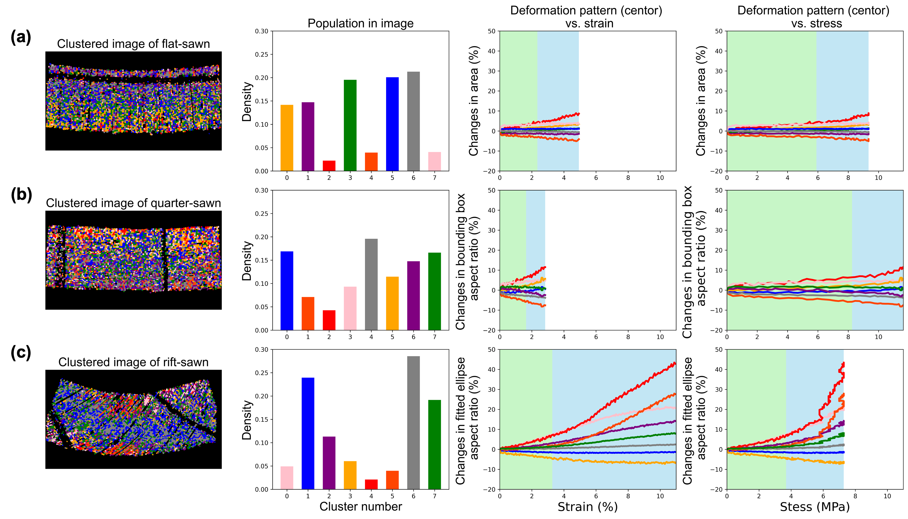
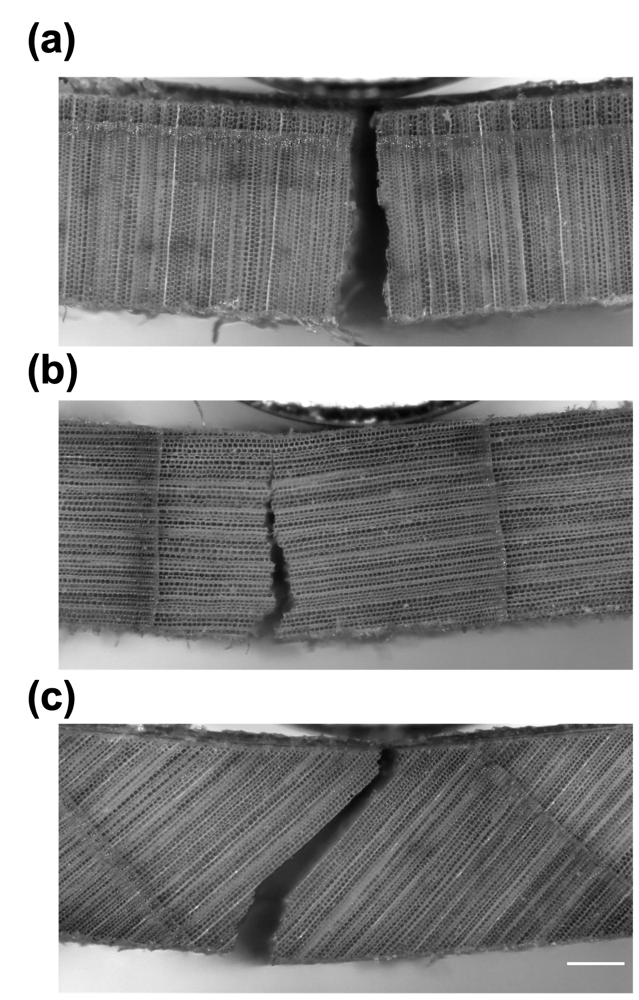

# Title:

# Flexural behavior of wood in transverse direction studied by computer vision and machine learning

---

Authors: Shuoye Chen,  Junji Sugiyama

Affiliations: Graduate School of Agriculture, Kyoto University, Kitashirakawa Oiwake-Cho, Sakyo-ku, Kyoto 606-8502, Japan

E-mail: chenshuoye@gmail.com

---

## Abstract

A deep-learning based semantic segmentation approach (U-Net) was used to partition anatomical features in cross section of hinoki (*Chamaecyparis obtusa*) during micro three-point bending test. With the help of Crocker-Grier linking algorithm, thousands of cells were successfully extracted. Then, several parameters (area, eccentricity, major/minor axis length, vertical/horizontal bounding box length) were used to evaluate the intensity of their deformation. Finally, 2D mapping of a deformation intensity distribution was successfully built. By analyzing the cell deformation of flat-, quarter-sawn and rift-sawn, we have confirmed the orientation of annual ring affect the flexural behavior of wood in transverse direction. The quarter-swan showed the largest MOE and MOR. The ray tissue aligned against the loading might play an important role in the restriction of the cell wall deformation. The rift-sawn specimen showed smallest MOE and MOR and its reason might be the loading of specimen in the in-plane off-axial direction, which induces the shear deformation of the cell wall. For all three types of specimens, the fracture has high possibility occurring at the tension part that showed large cell deformation. Therefore, the novel method developed in this study might be adapted to the fractures prediction of the wood specimen. Furthermore, with varying the test wood species such approach provides a great possibility to unveil the relationship between anatomical features and mechanical behavior of wood in transverse direction.

## Keywords:

Flexural behavior, Cell wall deformation, Semantic segmentation, Individual cell tracking, Computer vision, Deep learning

---

## 1. Introduction

Wood is a natural cellular material, and it has complex structure with different cell types (anatomical features) acting together to serve the needs of living tree [1]. Also, as an anisotropic material,  wood has excellent mechanical properties parallel to the grain ( longitudinal direction), while its mechanical properties perpendicular to the grain (transverse direction) are relatively weak [2] and varied among different wood species with relation to their unique anatomical features [1].

From ancient time, human already started to use wood as a construction materials considering the microstructure of wood in transverse direction. For instance, a traditional roofing method called kokerabuki in Japanese [3]. The quarter-sawn borads with 2-3 mm of thickness, 90-150 mm of width and 300 mm of length were stacked at the flat part of the roofs, while the rift-sawn boards were selected for the curve surface of the roofs due to its excellent flexibility according to the empirical knowledge of Japanese artisan. And now, understanding the relationship between anatomical features and mechanical behavior of wood is an important subject in the field of wood science for the improvement of the effective utilization of wood resources. To clarify the relationship, wood scientists have developed several approaches mainly from the two perspectives.

The first one is **top-down perspective** that is direct microscopic observation of deformation of anatomical features during or after the mechanical test. Ando and Onda (1999) [4] used wet-type scanning electron microscope (SEM) to observe the compression of wood cell wall. Combing with image analysis, it was found that the first fracture of cell wall occurred in one tangential row of earlywood tracheids just after the load displacement curve exceeded the proportional limit. Müller et al. (2003) [5] observed cell deformation of both softwood (spruce) and hardwood (oak and beech) at different yielding stage of compression test by using both SEM and light microscope for concluding different fracture pattern of anatomical features in those species. Hwang et al. (2021) [6] used the replica method to intermittently analyze the cell wall deformation of flat-swan, quarter-swan and rift-swan in transverse direction of wood due to three point bending test. The rift-swan of softwood exhibited a unique shear deformation of earlywood cell wall contributing for the extremely large flexural deformation. Such direct microscopic observation methods provides important information to understand the in-situ deformation of wood microstructures.

The second one is **bottom-up perspective** that is the mechanical simulation of wood properties considering its hierarchical structure.  Watanabe et al. [7, 8, 9] firstly used fast Fourier transform (FFT) to extract the characteristics such as axial length of tangential and radial cell wall, cell wall thickness, etc. of several conifer wood species for simulating the tangential Young's modulus by cell wall model. Ando and Onda [10] used generalized cell wall model to successfully simulated the first buckling mechanism of conifer wood cell wall under radial compression. Holmberg et al. [11] used finite element method (FEM) to simulate the nonlinear mechanical behavior considering the irregular cell shape, anisotrpic layer structure of the cell walls and the periodic variations in density of wood. And their simulated deformation and fracture of wood was similar to the those found in the refining process of wood. De Magistris and Salmén [12] investigate the compression and in combined shear and compression deformation of cell wall with anisotropic one-layer cell walls and orthotropic multi-layer cell wall models by finite element method (FEM) . Their results indicates the cell structures is the key factors influencing the deformation pattern.  Recently the multi-scale FEM is adopted to simulate wood compression behavior under both axis and transverse loading [13]. It was found that transverse deformation of wood is gradual and uniform,  while the loading velocity greatly affects wood microstructure failure modes in axial loading. Those developed approaches are quite useful and powerful for providing comprehensive explanation of mechanical behavior of  wood.

On the other hand, in the field of computer vision, the semantic segmentation has been proposed as a important approach to label each pixel of an image with a corresponding class of what is represented. With the development of artificial intelligence, the deep-learning based semantic segmentation model such as U-Net [14], LinkNet [15], Feature Pyramid Networks [16], and Pyramid Scene Parsing Network [17] has been developed and those technology that has large field of application and already started to be applied into the field autonomous vehicles [18] and  analysis of biomedical image for medical diagnosis [19]. If the approach of semantic segmentation can also be adapted for analyzing the cell wall deformation, it provides a great possibility to simultaneously analyze almost all local changes in anatomical features and their interaction during the mechanical test. Furthermore, the observed information provides more accurate and quantitative image analysis and the collected cell wall geometry can also be used for more realistic mechanical simulation for optimizing developed both top-down and bottom-up approaches.

Therefore, in this study, the semantic segmentation model has been built for the partitioning of anatomical features of hinoki wood, and their local deformation during the micro three-point bending test were precisely analyzed with the help of individual cell tracking algorithm.

---

## 2. Materials and method

#### 2.1 specimen preparation

Hinoki (*Chamaecyparis obtusa*) was used in this study. Three types of (flat-swan, rift-swan and quarter-swan) samples were firstly prepared considering their orientation of annual ring by visual confirmation. The annual ring aligned at horizontal direction and vertical direction were 0° and 90°, respectively. The sample with the angle of annual ring of 0° to 30° was defined as flat-swan, 30° to 60° was defined as rift-swan and 60° to 90° were defined as quarter-swan. After that, the 5 specimens of flat-swan, quarter-swan and rift-swan, respectively, were prepared with the dimension of 10 mm (longitudinal) x 20 mm (width) x 1.5 mm (thickness). Then, the cross section of all specimens were smoothed by a sliding microtome (TU-213, Yamato kohki industrial Co., Ltd., Japan). All specimens were then  conditioned at a plastic glove box at 60% relative humidity (RH) and 25°C by using sodium bromide solution for more than two weeks.

#### 2.2 micro three-point bending test

After the conditioning, all specimens were subjected to the micro three-point bending test. The customized metal jig (Fig. X (a)) was used for the test. A motor (BLM230P-GFV2, ORIENTAL MOTOR Co.,Ltd., Japan) with test speed of 1mm/min was used to horizontally bend the specimen. And a 200N load cell (LUR-A-200NSA1, Kyowa Electronic Instruments Co., Ltd., Japan) with sensor interface (PCD-320A, Kyowa Electronic Instruments Co., Ltd., Japan) was used to record the force, the sampling speed is 1Hz. During the test, a stereo-microscope (Leica DMS300, Leica Camera AG, Germany) was set perpendicular to the cross section  to record the deformation of cell wall by video mode with 30 fps. The resolution was 1080p and the length of one pixel is equal to about 2.09 *µ*m. All experiment was conducted at 60% RH and 25°C.

Fig. 1 The illustration of micro three-point bending test. (a) The illustrated apparatus used for the test. (b) Cross section of wood specimen observed by stereo-microscope.

#### 2.3 Deep learning based semantic segmentation model

For preparation of training dataset and model training, after the video taking during the bending test, the first image at every second of the video was captured to prepare the image sequence. The 12 original images with 256 pixels x 256 pixels were cropped from the image sequence. The watershed segmentation was firstly applied for labeling the boundary of tracheid cell. The unlabeled part was manually modified to make their corresponding ground truth masks with cell wall boundary labeled in white and background labeled in black. Due to the issue of image resolution, the part of ray tissue was recognized as a part of tracheid cell in this study.

Finally, 12 sets of original image and corresponding ground truth mask were used for building semantic segmentation model. And the asymmetric U-net architecture was used for the model training. The network was implemented using Tensorflow framework version 1.5.0 and Keras version 2.2.4. The binary cross entropy was used as the loss function, and adam was used as the optimizer. The learning rate was 0.0001. During the model training, the augmentation of image by image generator was applied (Fig.2).

Fig. 2 Preparation of dataset for semantic segmentation model training. (a) Cropped patch of cross section of wood; (b) cell wall boundary labeled mask by watershed segmentation algorithm (c) manually corrected image mask. The scale bar indicates length of 100 *μ*m

#### 2.4 Metrics for model evaluation

Four metrics were used for evaluating the trained model. They were accuracy, recall, precision, and f1-score. Those metrics were calculated from true positive (TP), false positive (FP), true negative (TN) and false negative (FN) obtained from the confusion matrix for the binary classification of cell boundary and background. The formula for the calculation were showed as below:

#### 2.5 image prediction and individual cell tracking

After model training, the trained model combined with the patch blending algorithm [20] were used to partition all potential cells in the image sequence with 1920 pixels x 1080 pixels. After predicting all image sequence, watershed segmentation was applied to achieve the instance segmentation of all cells. Finally, the coordinates of centriod of segmented cells were collected and a tracking algorithm (Crocker-Grier linking algorithm) [21] implemented by trackpy [22] was used to link the same cell walls exist at each image.

Fig.3 tracking the cell wall deformation during mechanical test. (a) watershed segmentation of predicted image by trained U-net model to achieve instance segmentation; (b) The coordinates of centriods of each cell wall were exacted as the features for particle linking; (c)  trajectories was found by Crocker-Grier linking algorithm.

#### 2.6 parameters measurement for cell wall deformation analysis

Finally, after the tracking of individual cells existing at every image sequence, the area, eccentricity, length of major and minor axis of fitted ellipse, and length of vertical and horizontal length of bounding box for each cell wall were measured (Fig.4). Those measurements were implemented by python package: scikit-image[23]. Furthermore, the fitted ellipse aspect ratio and the aspect ratio of vertical and bounding box aspect ratio were also calculated. For evaluating the intensity of cell wall deformation, the changes in area, eccentricity, fitted ellipse aspect ratio and bounding box aspect ratio were calculated based on the following equation:

the n indicates the order of the observed image sequence. The i indicates the measured parameters showed on Fig.4.

Fig.4 the measurement parameters to evaluate the intensity of deformation of cell wall

---

## 3. Results and discussion

#### 3.1 flexural behavior of flat-sawn, quarter-sawn and rift-sawn in transverse direction

Fig.5 mechanical properties of flat-swan, quarter-swan and rift-swan of hinoki specimens in transverse direction. (a) load and displacement of three types of hinoki specimens during micro three-point test. (b) MOE (modulus of elasticity) and MOR (modulus of rupture) of three types of hinoki specimen; the error bars indicate the standard deviation.

The Fig.5 showed the difference in the mechanical properties of flat-, quarter-, and rift- sawn in transverse direction. During the micro three-point bending test, the rift-sawn specimen showed smallest load values with largest displacement at around 3.3 mm, resulting the smallest modulus of elasticity (MOE) and modulus of rupture (MOR) (Fig. 5 (a)). If we assume the linear stage of load-displacement as the elastic region and nonlinear stage as plastic region. The rift-sawn specimen showed the largest plastic region. In contrast,  the quarter-sawn showed the largest MOE and MOR (Fig.X (b)) with the smallest plastic region.

Those results agree with the previous study [6], which suggests the orientation of annual ring plays an important role on the flexural behavior of wood in transverse direction. It also demonstrates that built micro three bending test system in this study is reliable for discussing the mechanical properties of wood in transverse direction.

#### 3.2 Validation of U-Net model and large image prediction.

With the development of artificial intelligence, the fully convolutional networks (FCN) was proposed for conducting the semantic segmentation [24]. Furthermore, as an improvement of FCN, the U-Net architecture was proposed by Ronneberger et al.[14] , which is designed to allow fewer training samples for model training. It is a U-shape architecture consisting of encoder blocks, decoder blocks and skip connections. It has became one of the most popular approaches for any semantic segmentation tasks. Recently, the U-net model has also been applied for the segmentation of plant tissues [25] and xylem vessels in stained cross-section of wood [26] with excellent accuracy. Therefore, in this study, the U-Net has been selected for building model.

The Fig.6 (a) shows the evolution of binary cross entropy loss during 100 epochs training with U-Net architecture. After about 40 epochs training, the validation loss tended to became almost constant, while the loss continue to decreasing to about 0.1.  Four metrics were used for evaluating the trained model. The Table 1 showed the averaged value of those four metrics with the standard deviation. 

The Fig.6 (b) shows a example of input original image and Fig.6 (c) is the predicted image of original image through the trained model. The combination of patch blending algorithm and trained model worked well to predict the large image. The most of trachied cells seemed to be well segmented, while the partition of latewood trachied cells was not well predicted. It is known that the latewood trachied cell has quite small cell area and cell lumen makes it difficult to prepare the accurate masks from the image taken by the stereo microscope. To overcome the problem, the improvement of  image resolution will be needed by optimizing the methodology of microscopic observation. 

To further confirm the accuracy of the segmentation, the geometry parameters of a flat-swan specimen were measured. The vertical bounding box and horizontal bounding box were regraded as cell radial diameter and cell tangential diameter. The Fig.7 showed the distribution of typical parameters measured from the segmented cells. The averaged cell area, cell eccentricity, cell radial diameter and cell tangential diameter were 955 *μ*m2 (306), 0.596 (0.146), 37.5 *μ*m (7.63) and 34.8 *μ*m (6.62), respectively. Those measured geometry values agree with the previous research [27] suggesting a accurate segmentation model has been built.

Table. 1 the evaluated metrics for predicted images by trained U-Net model. The values in parentheses indicate the standard deviation.

| recall       | precision    | F1           | accuracy     |
|:------------:|:------------:|:------------:|:------------:|
| 0.82 (0.019) | 0.82 (0.017) | 0.82 (0.017) | 0.92 (0.006) |

Fig. 6 cell wall boundary prediction by trained U-net model. (a) binary cross entropy loss plotted against the training epochs; (b) input original image; (c) predicted image. The scale bar indicates length of 400 *μ*m.

Fig.7 the distribution of cell area (a), cell eccentricity (b), cell tangential diameter (c) and radial diameter measured from one specimen before.

#### 3.3 Typical deformation patterns of tracheid cell wall in three types of specimens

The Fig.8 showed a typical deformation pattern of tracheid earlywood cell wall located at the compression part and tension part of three types of specimens. The changes in shape of single cell wall located at both compression part and tension part of specimen during the mechanical test were intermittently extracted. And our results agree with the previous study that use replica method to intermittently observe cell wall deformation of rift-swan specimen [6].

For flat-sawn specimen, a uniaxial compression and tension of tangential cell wall were possibly occurred at the compression and tension part of specimen, respectively. And because of the orthogonal orientation of cell wall in quarter-swan, the deformation of radial cell wall was observed. As quarter-swan was fractured when displacement reach to around only 1 mm, the dimensional changes of cell wall were relatively smaller than that of flat-swan. 

Different with flat- and quarter-sawn specimen, the cell wall in rift-sawn seemed to show a different deformation pattern.  The shear deformation of cell wall along the vertical and horizontal direction was observed at compression part and tension part, respectively. Furthermore, such orientation of tracheid cells was quite similar to the uniaxial loading of honeycombs in the in-plane off-axial direction. Li et al.[28] have simulated the in-plane yield strengths of the square honeycombs in different direction under the compression by theoretical approach and FEM method. They have concluded the square honeycombs show a strong anisotropy when loaded in different orientations. And the numerical simulation indicates that the axial yield strength of the square honeycomb have minimum values at the angle of orientation with 37 degree to 38 degree, which is in the range of the orientation of annual ring for rift-swan. Therefore,  we suppose such shear deformation induced by the off-axis loading of trachied cell is responsible for the large displacement and low MOE and MOR of rift-swan specimen.

Fig.7 Typical deformation of wood cell wall for three types of hinoki specimens during micro three-point bending test. (a) cell wall deformation of flat-swan specimen, upper: compression part, lower: tension part; (b) cell wall deformation of quarter-swan specimen, upper: compression part, lower: tension part; (c) cell wall deformation of rift-swan specimen, upper: compression part, lower: tension part. The scale bar indicates 50 μm

#### 3.4 Visualization of the distribution of trachied cell wall deformation

With the benefit of Grocker-Grier linking algorithm, the coordinates of centriods for each common tracheid cell existed at each frame were successfully linked. Therefore, thousands of common cells were extracted. Finally, after evaluating the intensity of the deformation by described in the section of materials and method, the 2d mapping of the intensity of deformation for three types of specimen was successfully built.  At the elastic region, all specimens showed relative slight and varied deformation for all parameters. When entering the plastic region, the cell wall deformation distribution differed. And intensity of the deformation reaches the maximum before the fracture of the specimen. The suitable parameter for the evaluation of deformation for those types of specimen were discussed as below.

For flat-swan, the area seems to be the most suitable parameter for the deformation evaluation. As shown in Fig.8, the area of cell increased in tension part and decreased in compression part of specimen. And the intensity the changes of compression part is likely smaller than that of tension part. It might due to the existence of the latewood at compression part contributing the restriction of deformation of cells. Both significant increase and decrease in eccentricity were observed in tension part of specimen. It is because such changes highly depends on original shape of the cell. In other words. the horizontal tension of wood cell wall induces both increase in eccentricity for circle-shape cell while it might induce the decrease in eccentricity for vertical ellipse-shaped cell. The similar result was also observed in the case of fitted ellipse aspect ratio. For the changes in bounding box aspect ratio,  the cells located at central part of specimen showed reasonable results. The increase and decrease in bounding box aspect ratio were observed in compression part and tension part, respectively. However, the bending test also caused the curve of the specimen that also change in the orientation of cell located at the surrounding part of the specimen and influence the reliability of their measured bounding box aspect ratio. 

For quarter-sawn specimen shown smallest plastic region in three types of specimen (Fig.9), the bounding box seems to be a promising parameter for the deformation evaluation. The changes in area varied even at the plastic region and before the fracture. The changes in the intensity of eccentricity and fitted ellipse aspect ratio increased for cell located at both compression and tension part.  In the case of bounding box aspect ratio,  as the specimen showed minor curve during the mechanical test, the compression induce the increase of the ratio and tension induce decrease of the ratio. And a neutral axis seems to be found at the almost center part of the specimen with the smallest changes in the ratio.

For rift-swan specimen (Fig.10), the area, eccentricity, and fitted ellipse aspect ratio seem to be robust parameters for its deformation evaluation.  In comparison to flat- and quarter-sawn, the more concentrated and intensive deformation was observed at the innermost of the compression part and outermost of the tension part of rift-sawn. A decrease in area for both compression part and tension part were found, which is corresponding to the region of increase in eccentricity and fitted ellipse aspect ratio. As described at previous section, the shear formation of cell is the dominant deformation pattern. And such deformation is responsible for increase in eccentricity. Also, the major axis length increased and minor axis length decreased to have the increase in fitted ellipse aspect ratio.  Same as the case of flat-sawn, rotation of the cell changes the orientation of cells to have unreliable results for the cell deformation.

Fig. 8 Intensity of cell wall deformation of flat-sawn specimen during micro three-point bending test evaluated by four parameters.

Fig. 9 Intensity of cell wall deformation of quarter-sawn specimen during micro three-point bending test evaluated by four parameters.

Fig. 10 Intensity of cell wall deformation of rift-sawn specimen during micro three-point bending test evaluated by four parameters.

#### 3.5 Clustering analysis of deformation pattern of individual cell and its relationship with stress-strain curve

After choosing the suitable parameter for the deformation evaluation, the changes in area, bounding box aspect ratio , and fitted ellipse aspect ratio were selected for discussing the deformation of cell for flat-sawn, quarter-sawn and rift-sawn, respectively. The k-means clustering algorithm was then applied to summarize the deformation pattern. And their relationship between strain and stress of the specimen were showed at Fig.11. And the Fig.12 showed the detailed fracture pattern of the three types of specimen. For all specimens, the fracture has high possibility occurring at the tension part that showed large cell deformation. Therefore, by the further improvement of microscopic observation and increasing the test wood species, the novel method developed in this study might be adapted to the fractures prediction of the wood specimen.

For flat-sawn, the large increase of area of cell occurred at the central tension part with orange, pink and red color, which is corresponding to the region of fracture started at tension part of the specimen (Fig.11(a)). And the detachment of the tangential cell wall between the cells is the reason for the fracture (Fig.12 (a)). 

For quarter-sawn, large increase and decrease of bounding box aspect ratio occurred at earlywood region near to the previous latewood region (Fig.11(b)). As the earlywood cell wall located at that region showed thinner cell wall thickness and large cell area resulting in weaker mechanical properties []. And we suppose it is the reason why the fracture of specimen induced by the detachment of the radial cell wall between cells started to occur at the earlywood region of the tension part (Fig.12(b)). Furthermore, as the ray tissue of quarter-sawn was aligned against the mechanical load, it is possible that ray tissue plays an important role in the restriction of cell wall deformation resulting in the larger MOE and MOR than that of flat-swan.

For rift-swan, the large shear deformation were concentrated along the radial files of the earlywood with the light blue and red color (Fig.11 (c)). Due to the orientation of the annual ring around 44.5 degree, the ray tissue seems to have minor restriction for the cell walls. And the detachment of tangential cell wall between cells along the radial direction dominated the fracture pattern of the specimen (Fig.12 (c)).

Discussion for relationship between changes in parameters and stress-strain.

Fig.11 The k-mean clustering results of deformation pattern and their relationship with strain and stress of specimen. (a) clustering results of changes in area for flat-sawn. (b) clustering results of changes in bounding box aspect ratio for quarter-sawn. (c) clustering results of changes in fitted ellipse aspect ration for rift-sawn. 

Fig.12 The fracture of the flat-, quarter-, and rift- swan specimen after micro three-point bending test. The scale bar indicates 400 μm.

---

## 4. Conclusion

In this study,  a  deep-learning based semantic segmentation approach with U-Net architecture was used to partition anatomical features in cross section of hinoki during the micro three-point bending test. With the help of Crocker-Grier linking algorithm, thousands of cells were successfully extracted. Then, several parameters (area, eccentricity, major/minor axis length, vertical/horizontal bounding box length) were used to evaluate the intensity of their deformation. Finally, 2D mapping of a deformation intensity distribution was successfully built. And the main conclusions for analyzing the flat-sawn, quarter-sawn and rift-sawn specimens are as follow:

1. The area and bounding box aspect ratio were suitable for evaluating the cell wall deformation of flat-sawn and quarter-sawn specimen, respectively. As a relative large cell deformation induced for the rift-sawn specimen, the area, eccentricity and fitted ellipsed aspect ratio are robust parameters for the cell wall deformation evaluation.

2. The quarter-swan showed the largest MOE and MOR. The ray tissue aligned against the loading might play an important role in the restriction of the cell wall deformation.

3. The rift-sawn specimen showed smallest MOE and MOR and its reason might be the loading of specimen in the in-plane off-axial direction, which induces the shear deformation of the cell wall.

4. For all three types of specimens, the fracture has high possibility occurring at the tension part that showed large cell deformation. Therefore, the novel method developed in this study might be adapted to the fractures prediction of the wood specimen

---

## 5. Reference

> 1. Ross Robert J., Wood Handbook-Wood as an Engineering Material, WI :U.S. Dept. of Agriculture, Forest Service, Forest Products Laboratory, 2010. https://doi.org/10.2737/FPL-GTR-190

> 2. L.J. Gibson, M.F. Ashby, Cellular Solids: Structure and Properties,  Pergamon Press, New York, 1998.

> 3. S. Yokoyama, Restoration discussion of Saitama prefecture specified tangible cultural property Yakyu Inari shrine (in Japanese). AIJ J. Technol. Des. 22 (2016) 1143-1148. https://doi.org/10.3130/aijt.22.1143

> 4. K. Ando and H. Onda, Mechanism for deformation of wood as a honeycomb structure I: effect of anatomy on the initial deformation process during radial compression,  J. Wood Sci. 45 (1999) 120-125. https://doi.org/10.1007/BF01192328

> 5. U. Müller, W. Gindl, A. Teischinger, Effects of cell anatomy on the plastic and elastic behaviour of different wood species loaded perpendicular to grain. IAWA J. 24 (2003) 117–128. https://doi.org/10.1163/22941932-90000325https://doi.org/10.1163/22941932-90000325

> 6. S. Hwang, H. Isoda, T. Nakagawa, J. Sugiyama, Flexural anisotropy of rift-sawn softwood boards induced by the end-grain orientation. J. Wood Sci. 67 (2021) 14. https://doi.org/10.1186/s10086-021-01946-y

> 7. U. Watanabe, M. Norimoto, T. Ohgama, M. Fujita M, Tangential Young’s modulus of coniferous early wood investigated using cell models, Holzforschung 53 (1999) 209–214. https://doi.org/10.1515/HF.1999.035

> 8. U. Watanabe, M. Norimoto, T. Morooka, Cell wall thickness and tangential Young’s modulus in coniferous early wood. J. Wood Sci. 46 (2000) 109–114. https://doi.org/10.1007/BF00777356

> 9. U. Watanabe, M. Fujita, M. Norimoto (2002) Transverse Young’s moduli and cell shapes in coniferous early wood. Holzforschung 56 (2002) 1–6. https://doi.org/10.1515/HF.2002.001

> 10. K. Ando K and H. Onda, Mechanism for deformation of wood as a honeycomb structure II: First buckling mechanism of cell walls under radial compression using the generalized cell model, J. Wood Sci. 45 (1999) 250-253. https://doi.org/10.1007/BF01177734

> 11. S. Holmberg, K. Persson, H. Petersson, Nonlinear mechanical behaviour and analysis of wood and fibre materials. Comput. Struct. 72 (1999) 459-480. https://doi.org/10.1016/S0045-7949(98)00331-9 

> 12. F. De Magistris, L. Salmén, Finite Element modelling of wood cell deformation transverse to the fibre axis. Nord Pulp Pap. Res. J. 23 (2008) 240–246. https://doi.org/10.3183/npprj-2008-23-02-p240-246

> 13. W. Zhong, Z. Zhang, X. Chen, Q. Wei, G. Chen, X. Huang, Multi-scale finite element simulation on large deformation behavior of wood under axial and transverse compression conditions. Acta Mech. Sin. 37 (2021) 1136-1151. https://doi.org/10.1007/s10409-021-01112-z

> 14. O. Ronneberger, P. Fischer, T. Brox, U-Net: convolutional networks for
>     biomedical image segmentation, Lect. Notes Comput. Sci. (including Subser Lect Notes Artif Intell Lect Notes Bioinformatics) 9351 (2015) 234–241. 

> 15. A. Chaurasia, E. Culurciello, LinkNet: Exploiting encoder representations for efficient semantic segmentation, 2017 IEEE Visual Communications and Image Processing (VCIP) (2017) 1–4. https://doi.org/10.1109/VCIP.2017.8305148

> 16. T. -Y. Lin, P. Dollár, R. Girshick, K. He, B. Hariharan, S. Belongie, Feature pyramid networks for object detection,  2017 IEEE Conference on Computer Vision and Pattern Recognition (CVPR) (2017) 936–944. https://doi.org/10.1109/CVPR.2017.106

> 17. H. Zhao, J. Shi, X. Qi, X. Wang, J. Jia,  Pyramid scene parsing network, 2017 IEEE Conference on Computer Vision and Pattern Recognition (CVPR)  （2017) 2881–2890. https://doi.org/10.1109/CVPR.2017.660

> 18. X. Liu, Y. Han, S. Bai, Y. Ge, T. Wang, X. Han, S. Li, J. You, J. Lu, Importance-aware semantic segmentation in self-driving with discrete Wassersetin training, Proceedings of the AAAI Conference on Artificial Intelligence 34 (2020) 11629-11636. https://doi.org/10.1609/aaai.v34i07.6831

> 19. D. Müller, F. Kramer, MIScnn: a framework for medical image segmentation with convolutional neural networks and deep learning, BMC Med. Imaging 21 (2021) 12. https://doi.org/10.1186/s12880-020-00543-7

> 20. https://github.com/Vooban/Smoothly-Blend-Image-Patches ???

> 21. J.C. Crocker, D.G. Grier, Methods of digital video microscopy for colloidal studies, J. Colloid Interf. Sci. 179 (1996) 298–310. https://doi.org/10.1006/jcis.1996.0217

> 22. D. B. Allan, T. Caswell, N.C. Keim, C.M. van der Wel, Trackpy v0.5.0. (Version 0.5.0), Zenodo, April 13, 2021. https://doi.org/10.5281/zenodo.4682814

> 23. S. van der Walt, J.L. Schönberger, J. Nunez-Iglesias, F. Boulogne, J.D. Warner ,N.  Yager, E. Gouillart, T. Yu, the scikit-image contributors,  Scikit-image: image processing in Python. PeerJ 2 (2014) e453 https://doi.org/10.7717/peerj.453

> 24. J. Long, E. Shelhamer, T. Darrell, Fully convolutional networks for semantic segmentation, 2015 IEEE Conference on Computer Vision and Pattern Recognition (CVPR) (2015) 3431-3440. https://doi.org/10.1109/CVPR.2015.7298965

> 25. A. Garcia-Pedrero, I.A. García-Cervigón, J.M. Olano, M. García-Hidalgo, M. Lillo-Saavedra, C. Gonzalo-Martín, C. Caetano, S. Calderón-Ramírez, Convolutional neural networks for segmenting xylem vessels in stained cross-sectional images. Neural. Comput. Appl. 32 (2020) 17927-17939. https://doi.org/10.1007/s00521-019-04546-6

> 26. A. Wolny, L. Cerrone, A. Vijayan, R. Tofanelli, A.V. Barro, M. Louveaux, C. Wenzl, S. Strauss, D. Wilson-Sánchez, R. Lymbouridou, S.S. Steigleder, C. Pape, A. Bailoni, S. Duran-Nebreda, G.W. Bassel, J.U. Lohman, M. Tsiantis, F.A. Hamprecht, K. Scheitz, A. Maizel, A. Kreshuk,  Accurate and versatile 3D segmentation of plants tissues at cellular resolution,  elife 9 (2020) e56713. https://doi.org/10.7554/eLife.57613

> 27. Saiki H (1963) Studies on annual ring structure of coniferous wood II Demarcation between earlywood and latewood (in Japanese). Mokuzai Gakkaishi 9: 231-236.

> 28. X. Li, Z. Lu, Z. Yang, C. Yang, Anisotropic in-plane mechanical behavior of square honeycombs under off-axis loading. Mater. Des. 158 (2018) 88-97. https://doi.org/10.1016/j.matdes.2018.08.007 

> Gibson LJ (2012) The hierarchical structure and mechanics of plant materials. J R Soc Interface 9: 2749-2766.

---

## 6. Funding

This work was supported by JSPS KAKEN Grant Number 18H05485.
